# Manual Técnico — CinemaUSAC (Fase 1)

**Estudiante:** Dalio Miranda
**Carné:** 202100116
**Curso:** Estructuras de Datos — USAC
**Repositorio:** EDD_2S2026_PY_202100116

---

## 1. Introducción

CinemaUSAC es una aplicación de escritorio desarrollada en **C++17** con interfaz gráfica en **Qt6 (Widgets)**, que gestiona la operación de un cine: cartelera de películas, promociones, solicitudes especiales de clientes y reservas de asientos por función. Todas las estructuras de datos dinámicas que sostienen el sistema fueron implementadas manualmente, sin usar contenedores de la STL (`std::list`, `std::map`, `std::set`, etc.) para representar dichas estructuras.

El sistema se compila con **CMake** + **Ninja**, usando el compilador MinGW (GCC) que trae la distribución de MSYS2/Qt. Los reportes gráficos se generan con **Graphviz**, invocado desde C++ mediante `system()` sobre archivos `.dot` generados en tiempo de ejecución.

---

## 2. Arquitectura general

La aplicación separa dos capas:

- **Capa de datos**: 4 estructuras de datos independientes, cada una en su propio `.h`/`.cpp`, sin ninguna dependencia de Qt.
- **Capa de presentación**: clases de Qt Widgets (`MainWindow`, `PanelAdministrador`, `PanelCliente`, y sus pestañas) que reciben **referencias** a las estructuras de datos y las manipulan a través de su interfaz pública.

Las 4 estructuras viven como miembros de `MainWindow`, y se pasan por referencia a los paneles de Administrador y Cliente. Esto garantiza que ambos paneles trabajen siempre sobre **los mismos datos en memoria** — por ejemplo, una película agregada desde el panel Administrador aparece inmediatamente disponible para el panel Cliente, sin necesidad de sincronización adicional.

```
MainWindow
 ├── ArbolBinarioPeliculas cartelera
 ├── ListaCircularPromociones promociones
 ├── ListaCircularSolicitudes solicitudes
 ├── MatrizDispersaAsientos matrizAsientos
 │
 ├── PanelAdministrador (referencias a las 4 estructuras)
 │    ├── PanelAdminPeliculas
 │    ├── PanelAdminPromociones
 │    ├── PanelAdminSolicitudes
 │    └── PanelAdminFunciones
 │
 └── PanelCliente (referencias a las 4 estructuras)
      ├── PanelClienteCartelera
      ├── PanelClienteAsientos
      ├── PanelClienteCancelarReserva
      ├── PanelClientePromociones
      └── PanelClienteSolicitudes
```

La navegación entre pantallas usa un `QStackedWidget` controlado por `MainWindow`.

---

## 3. Estructura 1 — Árbol Binario de Búsqueda (Cartelera de Películas)

**Archivos:** `Pelicula.h`, `ArbolBinarioPeliculas.h/.cpp`

### 3.1 Diseño

```cpp
struct NodoArbolPelicula {
    Pelicula dato;
    NodoArbolPelicula* izquierdo;
    NodoArbolPelicula* derecho;
};
```

La clase `ArbolBinarioPeliculas` mantiene un puntero a la `raiz` y un contador de `tamanio`. Todas las operaciones (`insertar`, `eliminar`, `buscar`) están implementadas de forma **recursiva**, comparando el campo `codigo` de cada película (strings, comparados lexicográficamente).

### 3.2 Inserción y ordenamiento

No existe un algoritmo de ordenamiento aparte ejecutándose sobre un arreglo. En su lugar, se aplica el principio de **inserción ordenada** propio del BST: cada película nueva se coloca recursivamente en la posición que le corresponde según su código (menor a la izquierda, mayor a la derecha). El efecto práctico es el mismo que un *Insertion Sort* aplicado incrementalmente, pero aprovechando la estructura de árbol en vez de un arreglo, lo cual da complejidad **O(log n)** por inserción en el caso promedio (con el árbol razonablemente balanceado), contra O(n) que tomaría insertar ordenado en una lista enlazada.

### 3.3 Recorrido Inorden

El método `imprimirInorden()` / la recolección para la tabla de la GUI recorren el árbol con el patrón **Izquierda → Raíz → Derecha**, que para un BST garantiza que los elementos salgan en orden ascendente por código. Es el recorrido que exige el enunciado para mostrar la cartelera ordenada.

### 3.4 Búsqueda

El método `buscar(codigo)` desciende por el árbol comparando el código buscado contra el nodo actual: va a la izquierda si es menor, a la derecha si es mayor, hasta encontrarlo o llegar a `nullptr`. **Esta búsqueda es, en esencia, una búsqueda binaria**: cada comparación descarta la mitad restante del árbol (en el caso balanceado), por lo que no fue necesario implementar un algoritmo de búsqueda binaria aparte sobre un arreglo — el propio BST ya ofrece esa propiedad de forma natural. Se usa tanto para la búsqueda por código del cliente como internamente en `insertar` y `eliminar`.

### 3.5 Eliminación

`eliminar(codigo)` contempla los 3 casos clásicos de eliminación en BST:

1. **Nodo hoja** (sin hijos): se elimina directamente.
2. **Nodo con un solo hijo**: el hijo ocupa el lugar del nodo eliminado.
3. **Nodo con dos hijos**: se busca el **sucesor inorden** (el mínimo del subárbol derecho), se copia su dato al nodo actual, y luego se elimina el sucesor de su posición original (que siempre cae en el caso 1 o 2, nunca en el caso 3 de nuevo).

Este caso se probó explícitamente durante el desarrollo eliminando una película con dos hijos y confirmando que el recorrido inorden posterior seguía perfectamente ordenado.

### 3.6 Limitación observada: árbol degenerado

Durante las pruebas, al cargar el CSV de ejemplo (con códigos ya ordenados: P001, P002, P003...), el árbol resultante creció como una cadena hacia la derecha (equivalente en el peor caso a una lista enlazada), en vez de ramificarse. Esto es un comportamiento **matemáticamente esperado** de un BST simple sin balanceo automático cuando los datos de entrada ya vienen ordenados: cada nuevo nodo termina siendo siempre mayor que el anterior, así que se inserta siempre como hijo derecho.

Esto no afecta la corrección del sistema, pero sí su eficiencia en el peor caso (pasa de O(log n) a O(n) por operación). Es la motivación histórica detrás de estructuras más avanzadas como los árboles AVL o Red-Black, que se auto-balancean tras cada inserción — fuera del alcance de esta fase, pero relevante para la reflexión técnica del curso.

### 3.7 Estados de la cartelera

Para cada película se calcula un estado dinámico comparando la fecha actual del sistema contra `fechaEstreno` y `fechaFin`:

- **Próximo estreno**: si `fechaEstreno` es una fecha futura.
- **Próximo a retirar**: si faltan 7 días o menos para `fechaFin`.
- **En cartelera**: cualquier otro caso.

El cálculo de días se hace parseando las fechas `AAAA-MM-DD` con `sscanf` y comparándolas con `std::mktime`/`std::difftime`.

---

## 4. Estructura 2 — Lista Circular de Listas (Promociones y Beneficios)

**Archivos:** `Promocion.h`, `Beneficio.h`, `ListaCircularPromociones.h/.cpp`, `ListaDobleBeneficios.h/.cpp`

### 4.1 Diseño de dos niveles

- **Nivel externo**: `ListaCircularPromociones` es una lista **circular simple** (cada nodo solo tiene puntero `siguiente`; el último nodo apunta de vuelta al primero).
- **Nivel interno**: cada `Promocion` contiene, como miembro, una `ListaDobleBeneficios` — una lista **doblemente enlazada** propia con todos sus beneficios asociados.

### 4.2 Decisión de diseño: guardar el último nodo, no el primero

`ListaCircularPromociones` guarda un puntero `ultimo` en vez de `primero`. Esto es deliberado: como `ultimo->siguiente` siempre apunta al primer nodo (por ser circular), se puede calcular el primero en O(1) cuando se necesita, **y además insertar al final de la lista también queda en O(1)** (no hay que recorrer toda la lista para encontrar el último nodo antes de insertar).

### 4.3 Copia profunda de beneficios

Como `Promocion` contiene un objeto `ListaDobleBeneficios` (no un puntero), cada vez que se copia una `Promocion` (por ejemplo, al hacer `promociones.agregar(p)`, que copia el argumento), C++ también copia su lista de beneficios. Por defecto, C++ haría una copia superficial (shallow copy) de los punteros internos, lo que provocaría que dos promociones distintas terminaran compartiendo la misma memoria de nodos — un bug clásico de doble liberación (`double free`) al destruirse ambos objetos.

Para evitar esto, `ListaDobleBeneficios` implementa explícitamente:
- Constructor de copia (`ListaDobleBeneficios(const ListaDobleBeneficios&)`)
- Operador de asignación (`operator=`)

Ambos realizan una copia profunda, recorriendo la lista original y creando nodos nuevos e independientes.

### 4.4 Circularidad verificada

El método `recorrerCiclo(n)` recorre `n` pasos a partir del primer nodo, dando la vuelta tantas veces como haga falta — se usó para verificar visualmente (con `n` mayor al tamaño de la lista) que efectivamente el último nodo vuelve a conectar con el primero.

---

## 5. Estructura 3 — Lista Circular Doblemente Enlazada (Solicitudes Especiales)

**Archivos:** `Solicitud.h`, `ListaCircularSolicitudes.h/.cpp`

### 5.1 Diseño

A diferencia de la lista de promociones, aquí cada nodo tiene **ambos punteros**, `anterior` y `siguiente`, formando un ciclo doblemente enlazado. Esto permite recorrer la cola de solicitudes en ambos sentidos, lo cual es útil para una eventual navegación hacia atrás/adelante en la interfaz.

### 5.2 Autogeneración de datos

Cada solicitud registrada recibe:
- Un **número** autogenerado mediante un contador interno (`siguienteNumero`) que se incrementa en cada alta.
- Una **fecha** tomada del reloj del sistema (`std::time`, `std::localtime`).
- Un **estado** inicial de `"Pendiente"`.

### 5.3 Aprobar vs. Rechazar

El enunciado distingue dos acciones administrativas:
- **Aprobar**: cambia el `estado` del nodo (a `"En proceso"` o `"Atendida"`), sin eliminarlo — implementado en `cambiarEstado(numero, nuevoEstado)`.
- **Rechazar**: elimina la solicitud de la lista por completo — implementado en `eliminar(numero)`, reconectando los punteros `anterior`/`siguiente` del nodo vecino (con manejo especial si la lista queda con un solo nodo).

### 5.4 Búsqueda por cliente

`buscarPorTelefono(telefono)` recorre la lista completa y retorna todas las solicitudes que coincidan (un mismo cliente puede tener varias solicitudes activas simultáneamente), usado por la función de "Consultar Estado de Solicitudes" del panel Cliente.

---

## 6. Estructura 4 — Matriz Dispersa (Mapa de Asientos)

**Archivos:** `MatrizDispersaAsientos.h/.cpp`

### 6.1 Diseño ortogonal

Esta es la estructura más distinta de las cuatro. En vez de una matriz tradicional (arreglo bidimensional donde cada celda ocupa memoria exista o no dato), se implementó el diseño clásico de **matriz dispersa por listas ortogonales**:

- Cada **asiento reservado** genera **un único nodo** (`NodoAsiento`), que vive simultáneamente en **dos listas enlazadas distintas**: la lista de su fila (`siguienteEnFila`) y la lista de su columna (`siguienteEnColumna`).
- Los **asientos libres no generan ningún nodo** — no ocupan memoria en absoluto.
- Dos arreglos de punteros (`cabecerasFilas`, `cabecerasColumnas`), creados dinámicamente con `new NodoAsiento*[...]`, apuntan al primer nodo reservado de cada fila/columna respectivamente (o a `nullptr` si esa fila/columna no tiene reservas).

```cpp
struct NodoAsiento {
    int fila, columna;
    std::string nombreCliente;
    NodoAsiento* siguienteEnFila;
    NodoAsiento* siguienteEnColumna;
};
```

### 6.2 Ventaja de memoria

Para una sala de, por ejemplo, 500 asientos con solo 10 reservados, la matriz dispersa únicamente almacena 10 nodos — no 500. Esta es la ventaja central de la estructura frente a un arreglo 2D tradicional, y es especialmente relevante porque, según el enunciado, la mayoría de los asientos de una función suelen estar libres en un momento dado.

### 6.3 Operaciones

- **`reservarAsiento(fila, columna, nombre)`**: valida rango y disponibilidad, luego inserta el nuevo nodo de forma **ordenada** tanto en la lista de su fila (por columna) como en la de su columna (por fila) — esto acelera búsquedas futuras y mantiene consistencia con el diseño del reporte gráfico.
- **`cancelarAsiento(fila, columna)`**: localiza el nodo y lo desconecta de **ambas** listas antes de liberar su memoria.
- **`buscarReservasDeCliente(nombre)`**: recorre todas las cabeceras de fila devolviendo las coincidencias, usado por la función de cancelación desde el panel Cliente.

### 6.4 Una función a la vez (regla de Fase 1)

Según las condiciones del enunciado para esta fase, solo puede existir una función activa. `crearFuncion(...)` libera toda la memoria de la función anterior (recorriendo y eliminando todos sus nodos) antes de inicializar la nueva, evitando fugas de memoria al sobreescribir.

---

## 7. Algoritmos de ordenamiento y búsqueda (resumen)

El enunciado pide justificar los algoritmos de ordenamiento y búsqueda usados. En este proyecto ambos quedan resueltos por la naturaleza de las estructuras elegidas, en vez de implementarse como funciones sueltas sobre arreglos:

| Necesidad | Solución implementada | Complejidad (caso promedio) |
|---|---|---|
| Cartelera ordenada por código | Inserción ordenada en BST + recorrido Inorden | O(log n) inserción, O(n) recorrido completo |
| Búsqueda de película por código | Descenso en el BST (equivalente a búsqueda binaria) | O(log n) |
| Beneficios en orden de creación | Inserción al final en lista doble | O(1) |
| Promociones en orden de creación | Inserción al final en lista circular (con puntero a `ultimo`) | O(1) |

---

## 8. Reportes Graphviz

**Archivos:** `ReportesGraphviz.h/.cpp`

Cada uno de los 4 reportes construye el texto de un grafo en formato **DOT** usando `std::ostringstream`, recorriendo la estructura real en memoria (nunca datos de ejemplo hardcodeados). El texto se escribe a un archivo `.dot` en la carpeta `reports/`, y luego se invoca el comando externo `dot` vía `std::system()`:

```cpp
std::string comando = "dot -Tpng \"" + rutaDot + "\" -o \"" + rutaPng + "\"";
std::system(comando.c_str());
```

- **Reporte 1 (Cartelera/BST)**: recorrido recursivo del árbol, coloreando cada nodo según su estado (verde = en cartelera, amarillo = próxima a retirar).
- **Reporte 2 (Solicitudes)**: filtra solo las solicitudes en estado `"Pendiente"` y las conecta en un ciclo bidireccional.
- **Reporte 3 (Promociones)**: usa el atributo `rank=same` de Graphviz para alinear horizontalmente las promociones, con sus beneficios colgando verticalmente en línea punteada.
- **Reporte 4 (Matriz de asientos)**: dibuja un nodo diamante "Función" conectado a las cabeceras de fila y columna, y cada asiento reservado conectado a ambas cabeceras correspondientes — reflejando exactamente el diseño interno de la estructura ortogonal.

---

## 9. Interfaz gráfica (Qt Widgets)

La GUI se organiza en pestañas (`QTabWidget`) dentro de cada panel, siguiendo el patrón:

- **Tabla (`QTableWidget`)** para listar datos, poblada recorriendo la estructura correspondiente.
- **Diálogos (`QDialog` + `QFormLayout`)** para formularios de alta (agregar película, promoción, beneficio, crear función).
- **`QMessageBox`** para confirmaciones y mensajes de error/éxito.
- **Grilla de botones (`QGridLayout`)** para el mapa de asientos, coloreada dinámicamente según el estado real de la matriz dispersa (verde/rojo).

### 9.1 Sincronización entre pestañas

Como el panel Administrador y el panel Cliente comparten las mismas instancias de las estructuras (pasadas por referencia desde `MainWindow`), un cambio hecho desde un lado (por ejemplo, reservar un asiento desde Cliente) es inmediatamente visible del otro lado (Administrador). Para que la **vista** (la grilla dibujada) se mantenga sincronizada al cambiar de pestaña, se sobrescribió el evento `showEvent()` en los paneles que muestran la grilla de asientos y las promociones, forzando un redibujado cada vez que esa pestaña vuelve a ser visible.

### 9.2 Estilo visual

La aplicación usa una hoja de estilos QSS (similar a CSS) aplicada globalmente en `main.cpp`, con un tema oscuro y acento dorado, además de una marca de agua sutil del escudo de la USAC en la pantalla de inicio (dibujada con `QPainter` a baja opacidad).

---

## 10. Requisitos y compilación

- **Qt 6.11** (componente Widgets), MinGW 64-bit
- **CMake 3.16+** con generador **Ninja**
- **Graphviz** instalado y accesible en el PATH del sistema (`dot -version` debe funcionar)
- Compilador: GCC (MinGW/MSYS2)

```bash
cd EDD_Fase1
# Configurar (desde VS Code: CMake: Configure)
# Compilar (desde VS Code: CMake: Build)
cd build
./CinemaUSAC.exe
```

---

## 11. Capturas del sistema

### Pantalla de inicio


### Panel Administrador — Películas

Cartelera cargada desde CSV, ordenada por código (recorrido inorden del BST), con estados coloreados.

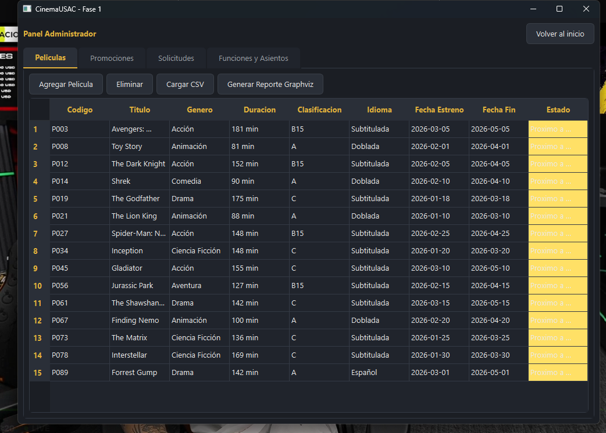

### Panel Administrador — Promociones

Tabla de promociones con su lista de beneficios asociados al seleccionar una fila.

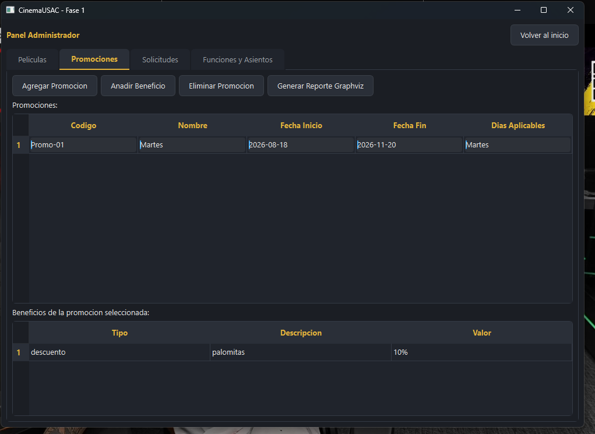

### Panel Administrador — Solicitudes

Gestión de solicitudes especiales: aprobar, rechazar y contador de pendientes.

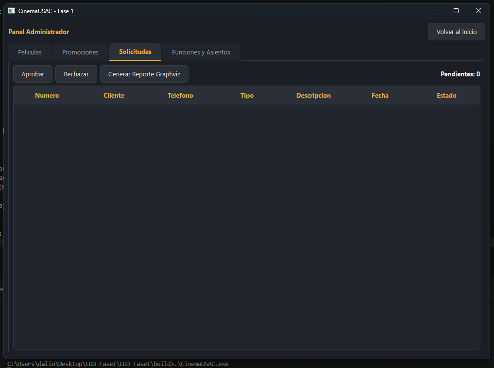

### Panel Administrador — Funciones y Asientos

Mapa de asientos generado a partir de la matriz dispersa (verde = libre, rojo = ocupado).

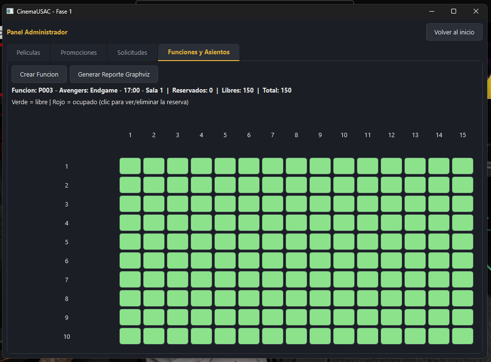

### Panel Cliente — Cartelera

Consulta de la cartelera completa, con búsqueda directa por código usando el BST.

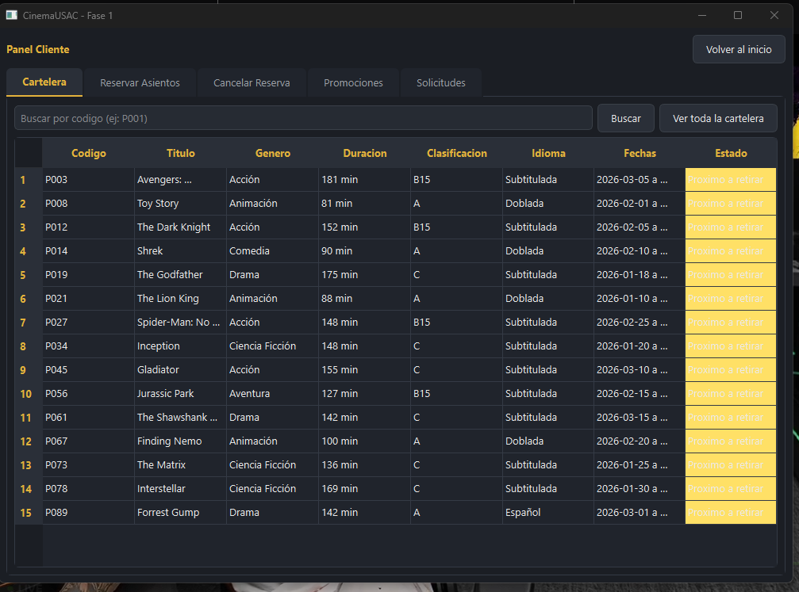

### Panel Cliente — Reservar Asientos

Reserva de asientos sobre la función activa, compartiendo la misma matriz dispersa que usa el administrador.

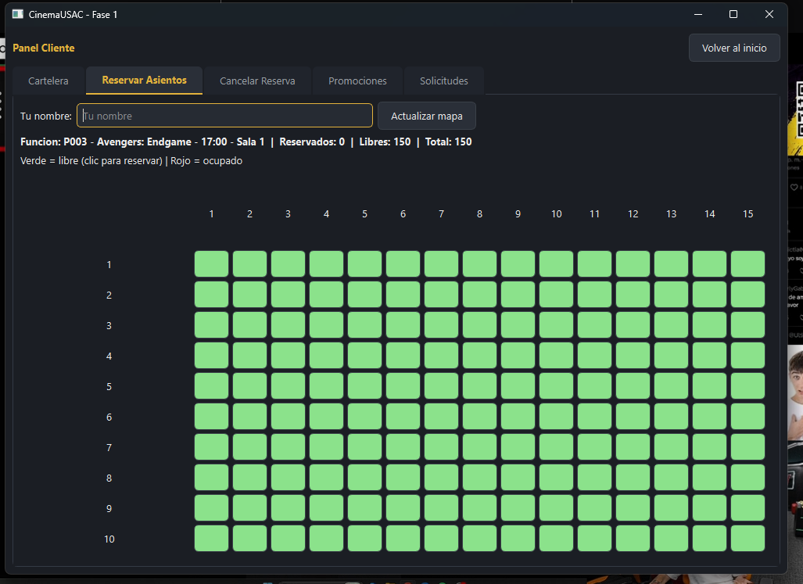

### Panel Cliente — Promociones

Solo se muestran las promociones vigentes según la fecha actual del sistema.

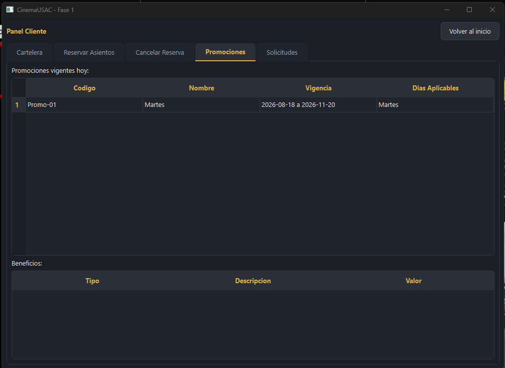

### Panel Cliente — Solicitudes

Formulario de solicitud especial y consulta de estado por número de teléfono.

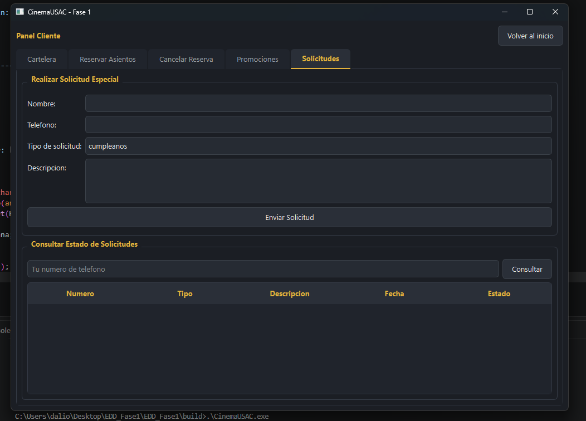

### Reportes Graphviz

**Reporte 1 — Árbol Binario de Búsqueda (Cartelera):**

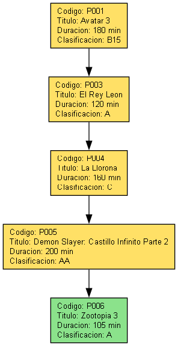

**Reporte 2 — Lista Circular Doblemente Enlazada (Solicitudes Pendientes):**

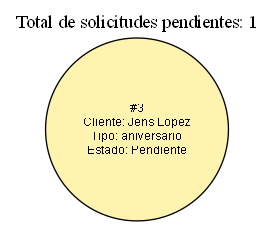

**Reporte 3 — Lista Circular de Listas (Promociones y Beneficios):**

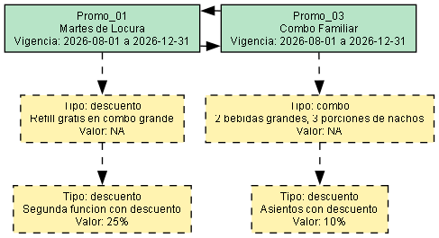

**Reporte 4 — Matriz Dispersa (Mapa de Asientos):**

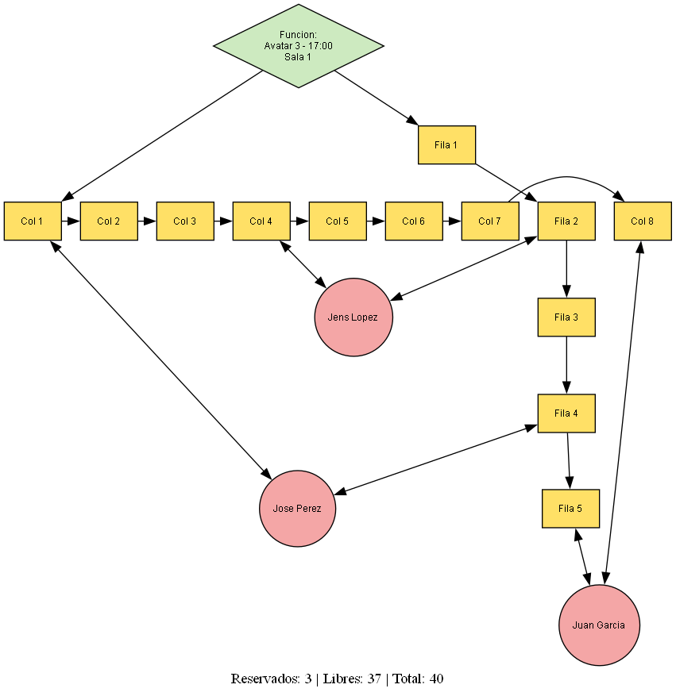

---

## 12. Conclusiones

El desarrollo de este proyecto permitió aplicar en un contexto integrado cuatro estructuras de datos dinámicas con propósitos y complejidades distintas: un árbol para búsquedas ordenadas eficientes, dos variantes de listas circulares para representar relaciones cíclicas y anidadas, y una matriz dispersa para modelar eficientemente datos mayormente vacíos. La principal dificultad técnica fue garantizar la correcta gestión manual de memoria (sin fugas ni referencias colgantes) en estructuras con relaciones cruzadas, como la copia profunda de listas anidadas en las promociones y la doble conexión de nodos en la matriz dispersa — ambos casos resueltos explícitamente y verificados mediante pruebas dirigidas antes de integrarlos con la interfaz gráfica.
